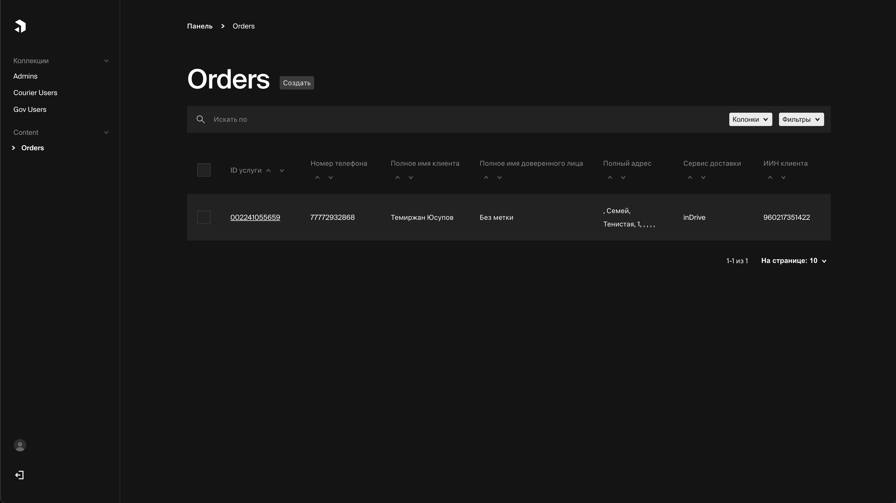

# Delivery service backend

Это source-код для бэкенд-части решения задачи от eGov и Huawei.

### Разворачиваем локально

```bash
cd hacknu-backend
docker-compose up
```

После выполнения этих команд, Вы сможете пройти в админ-панель по адресу `http://localhost:8080`.

### Demo

CMS, которую мы используем позволяет эффективно управлять курьерами, работниками ЦОНа и всеми заявками на доставку.


